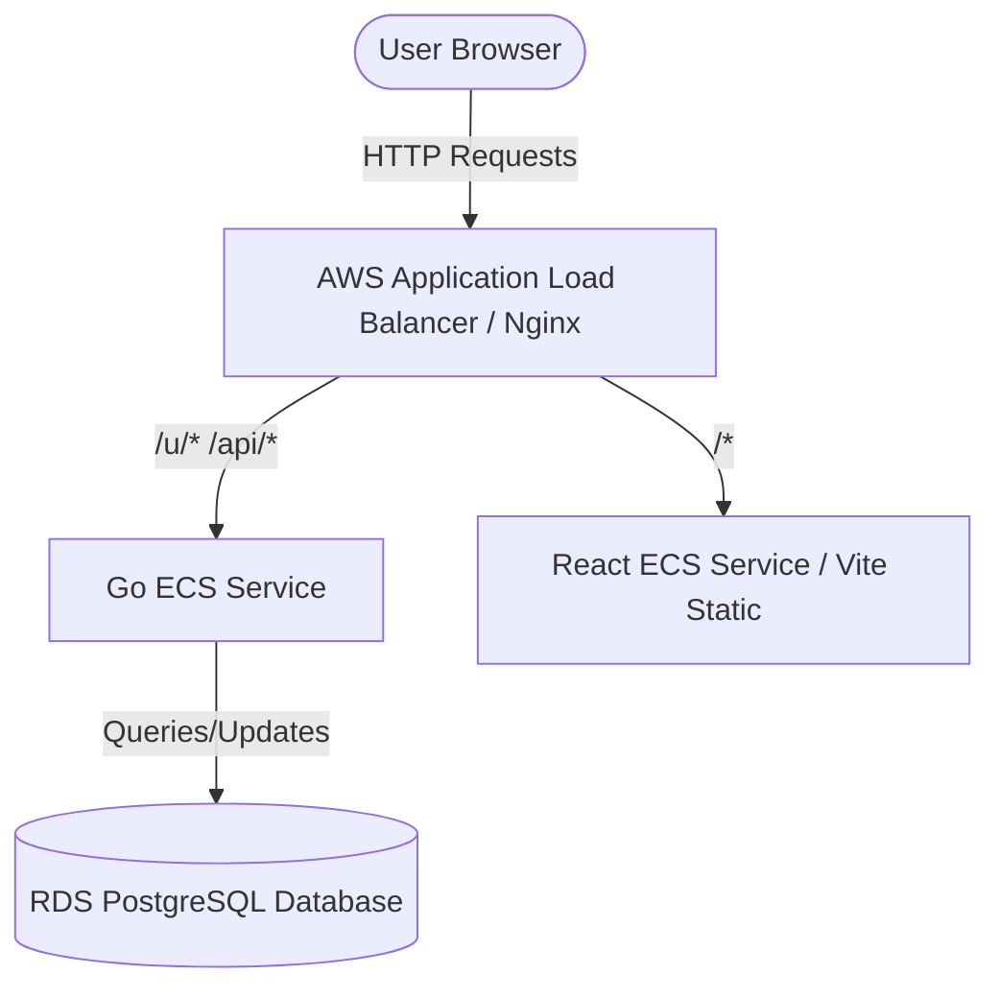

# ⚡ LinkPulse

LinkPulse is a next-generation, developer-first **Link-in-Bio** platform designed to consolidate your digital footprint, customize your visual identity, and monitor real-time traffic analytics.

Built with a high-performance **Go** backend and a sleek **React (TypeScript + Tailwind CSS)** frontend, LinkPulse features lightning-fast redirections, robust security, and cloud-native architecture ready for deployment on **AWS ECS Fargate**.

---

## 🚀 Key Features

*   **Custom Profiles:** Design and configure your visual landing page, biography, and external links with real-time editing.
*   **Local Image Uploads:** Select and crop your profile avatar directly from your PC (stored securely as Base64 strings in the database—no external storage dependencies required).
*   **Real-time Analytics:** Monitor daily click rates, top links, and referrer details (Twitter, GitHub, organic traffic) to measure audience engagement.
*   **High-Speed Redirects:** Go-based URL routing achieves sub-millisecond redirect performance.
*   **Google OAuth & JWT:** Secure access using JWT-based authorization alongside direct Google Sign-in.
*   **Dockerized Setup:** Standardized local environment mirroring the production system using Docker Compose.

---

## 🛠️ Tech Stack

### Frontend
*   **Framework:** React 18 with TypeScript & Vite
*   **Styling:** Tailwind CSS (Premium light theme alignment matching post-login dashboards)
*   **State & Validation:** React Hook Form + Zod
*   **Icons:** Lucide React

### Backend
*   **Language:** Go (1.26+)
*   **Web Framework:** Gin Gonic
*   **Database Access:** Pgx (PostgreSQL driver)
*   **Authentication:** JWT (JSON Web Tokens) & Google OAuth2

### Infrastructure & Cloud (AWS)
*   **Deployment:** AWS ECS (Elastic Container Service) on Fargate
*   **Load Balancing:** Application Load Balancer (ALB)
*   **Database:** AWS RDS PostgreSQL
*   **Storage:** AWS S3 (Static Uploads)
*   **Infrastructure as Code:** Terraform
*   **CI/CD:** GitHub Actions

---

## 💻 Local Setup & Installation

### Prerequisites
Make sure you have the following installed on your system:
*   [Docker & Docker Compose](https://www.docker.com/products/docker-desktop/)
*   [Go 1.26+](https://go.dev/dl/) (optional, for native development)
*   [Node.js v18+](https://nodejs.org/) (optional, for frontend local development)

### Step 1: Clone the Repository
```bash
git clone https://github.com/MRNaveed-stack/LinkPulse.git
cd LinkPulse
```

### Step 2: Configure Environment Variables
Create a `.env` file in the root directory (based on `.env.example` if available):
```env
PORT=8080
DB_HOST=postgres
DB_USER=postgres
DB_PASSWORD=postgres
DB_NAME=linkpulse
DB_PORT=5432
JWT_SECRET=your_super_secret_jwt_key
GOOGLE_CLIENT_ID=your_google_client_id.apps.googleusercontent.com
GOOGLE_CLIENT_SECRET=your_google_client_secret
OAUTH_REDIRECT_URL=http://localhost:8080/api/v1/auth/google/callback
FRONTEND_URL=http://localhost:5173
```

### Step 3: Run with Docker Compose
Start the frontend, backend, PostgreSQL database, and Nginx proxy with a single command:
```bash
docker-compose up --build
```
Once the containers are running:
*   **Frontend Web App:** Access at `http://localhost:3000` (or `http://localhost:5173` if running dev server)
*   **Backend API Service:** Base URL at `http://localhost:8080`

---

## 🏛️ Architecture Overview

The system runs a multi-container Docker setup locally and a cluster on AWS ECS:



*   **Nginx Proxy:** Handles routing and SSL termination, serving the React build for frontend paths and reverse-proxying `/api` requests to the Go service.
*   **PostgreSQL:** Stores user credentials, profiles, dynamic links, and analytical click logs.

---

## 📦 Production Deployment (AWS & CI/CD)

The project includes pre-configured **Terraform** manifests under the `/infra` folder to bootstrap the ECS cluster, subnets, RDS instance, security groups, and S3 resources.

### CI/CD Deployment Flow
Every push to the `main` branch triggers the GitHub Actions workflow, executing the following pipeline:
1.  **Build & Test:** Compiles both the Go backend and React frontend services.
2.  **Docker Push:** Containerizes applications and pushes images to **Amazon ECR**.
3.  **ECS Deployment:** Updates the ECS Task Definitions, deploying service tasks on AWS Fargate without downtime.

---

## 📄 License
This project is licensed under the MIT License.
