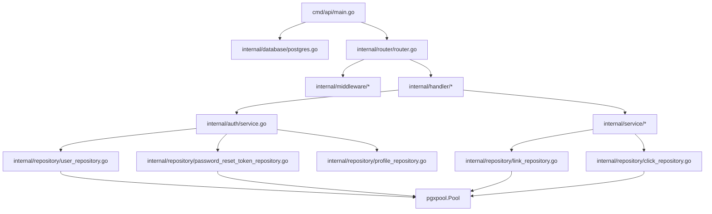

# LinkPulse: Go Backend Unit & Integration Testing Guide

Welcome to the **LinkPulse Testing Course and Architecture Guide**. This guide is custom-built for the LinkPulse codebase to help you transition from writing backend logic to designing, structuring, and writing robust test suites.

By the end of this guide, you will understand how to write unit tests, mock external dependencies, test REST endpoints, test SQL queries safely, and write integration tests that verify full user workflows.

---

## Phase 1 — Project Architecture Analysis

LinkPulse is built using Go, following structured, testable backend architecture principles:
1. **Separation of Concerns**: Each package has a distinct duty. Handlers parse HTTP requests; Services manage core business rules; Repositories execute database interactions.
2. **Interface-Driven Design**: The core components are wired together using Go interfaces (`AuthService`, `LinkService`, `UserRepository`, etc.). This decouple enables mock injection for unit testing.
3. **Dependency Injection (DI)**: Constructors (e.g., `NewAuthHandler`, `NewLinkService`, `NewUserRepository`) accept interfaces rather than concrete structs.

---

## Phase 2 — Request Lifecycle in LinkPulse

When an HTTP client hits the LinkPulse backend, the request travels through a predictable unidirectional hierarchy:

```
Request 
   ↓
[Middleware] (RateLimit, RequestLogger, Recovery)
   ↓
[Auth Middleware] (AuthMiddleware: validates JWT via auth.ValidateToken)
   ↓
[Handler] (e.g., LinkHandler: parses JSON, calls service)
   ↓
[Service] (e.g., LinkService: applies validation and domain rules)
   ↓
[Repository] (e.g., LinkRepository: maps struct to raw SQL via pgxpool)
   ↓
[Database] (PostgreSQL: persistent storage)
```

### Layer Responsibilities in LinkPulse
* **Middleware**: Handles cross-cutting concerns.
  * `RateLimit`: Protects endpoints from abuse based on client IP.
  * `RequestLogger`: Logs incoming request metrics (duration, path, status) using the global `logger.Log`.
  * `Recovery`: Catches uncaught panics inside handler goroutines, logging stack traces and returning a generic `500 Internal Server Error`.
  * `AuthMiddleware`: Extracts the `Authorization` header, parses the Bearer JWT, validates it against `JWT_SECRET`, and injects the `user_id` and `email` claims into the Gin context.
* **Handler**: The entry point for HTTP requests.
  * Decodes payload bindings (`c.ShouldBindJSON`).
  * Runs validations via custom validators (`validator.Validate`).
  * Maps business errors to appropriate HTTP statuses (`400 Bad Request`, `401 Unauthorized`, `403 Forbidden`, `404 Not Found`, `409 Conflict`, `500 Internal Server Error`).
* **Service**: Where the business logic lives. It coordinates multiple repositories and functions (e.g., hashing passwords with bcrypt, generating cryptographically secure password reset tokens, building JWT pairs). Services are decoupled from HTTP transport.
* **Repository**: Handles low-level database CRUD transactions using `*pgxpool.Pool`. It writes queries, handles joins, and maps SQL rows to Go structs.

---

## Phase 3 — Dependency Graph

Below is the visual dependency graph of LinkPulse:



### Why this Architecture makes Testing Easier
Because layers communicate via **Interfaces** and receive their dependencies via **Injectors (Constructors)**, we can isolate any layer during tests:
* **Testing Handlers**: We do not need a running database or even real services. We inject a mock service interface to assert that the handler responds with correct status codes when the service returns successful payloads or various errors.
* **Testing Services**: We mock the repositories to return simulated database rows or query errors, verifying that the business rules are fully covered.
* **Testing Repositories**: We use connection-level mocks or test databases to confirm SQL assertions.

---

## Phase 4 — Testing Theory

To write clean test suites, you must understand the different test scopes and concepts:

### 1. Unit Testing
* **Definition**: Testing a single, isolated function or method (e.g., testing `NormalizeReferrer("https://linkedin.com/feed/")` returns `"LinkedIn"`).
* **Isolation**: No network, database, or external file systems.
* **Application to LinkPulse**: Mock the user database to check if `AuthService.Register` properly hashes a password and generates a valid JWT without executing database writes.

### 2. Integration Testing
* **Definition**: Verifying that multiple layers or packages work together as expected.
* **Application to LinkPulse**: Running the API server against a test database, posting a register payload, logging in, creating a link, fetching it, and ensuring the database matches the expected output.

### 3. Repository Testing
* **Definition**: Testing the SQL queries, mapping code, and transactions.
* **Application to LinkPulse**: Ensuring the SQL queries in `LinkRepository.GetAnalyticsOverview` correctly select aggregate counts and do not contain syntax errors.

### 4. Handler Testing
* **Definition**: Testing HTTP routing, payload binding, validation, status codes, and HTTP header output.
* **Application to LinkPulse**: Sending custom request bodies to `/auth/register` to check that missing emails return `400 Bad Request`.

### 5. End-to-End (E2E) Testing
* **Definition**: Testing the entire system workflow from a client perspective (often automated with browser engines or HTTP clients mimicking a real user).

### 6. Mocks vs. Fakes vs. Stubs
* **Mock**: An object pre-programmed with expectations about calls it should receive (methods, parameters, return values).
* **Why mock repositories?**: Real databases are slow, prone to network issues, require setup, and make it difficult to simulate failures (such as a unique key constraint violation or a connection timeout). Mocks allow you to instantly trigger specific conditions.
* **Why should services NOT be mocked during service unit tests?**: If you are unit testing a service, that service is the **Subject Under Test (SUT)**. You only mock its *dependencies* (the repositories), not the service itself.
* **What should never be mocked?**: 
  * Pure logic utility functions (like `HashPassword` or `NormalizeReferrer`).
  * Plain Data Transfer Objects (DTOs) and models.
  * Standard library functions (unless wrapping complex OS-level interfaces).

---

## Phase 5 — Testing Libraries

The following Go libraries are standard, highly recommended, and fit LinkPulse:

1. **`testing`** (Standard Library)
   * The foundation. Built-in testing tools that execute tests using `go test`.
2. **`github.com/stretchr/testify`**
   * **Purpose**: Provides readable assertions (`assert.Equal`, `assert.NoError`) and mock structures (`mock.Mock`).
   * **Installation**:
     ```bash
     go get github.com/stretchr/testify
     ```
3. **`github.com/pashagolub/pgxmock/v3`**
   * **Purpose**: LinkPulse uses `pgxpool.Pool` for database connections. `pgxmock` mimics the connection pool without needing a running PostgreSQL instance, allowing you to mock `Query`, `Exec`, and `Scan`.
   * **Installation**:
     ```bash
     go get github.com/pashagolub/pgxmock/v3
     ```

---

## Phase 6 — Test Folder Structure

Maintain standard Go conventions by placing unit tests directly in the same package folder as their targets. For integration tests, keep them in a dedicated `tests/` directory at the project root:

```
LinkPulse/
├── internal/
│   ├── auth/
│   │   ├── service.go
│   │   ├── service_test.go (Unit tests for AuthService)
│   │   ├── jwt.go
│   │   └── jwt_test.go (Unit tests for Token generation)
│   ├── service/
│   │   ├── link_service.go
│   │   └── link_service_test.go (Unit tests for LinkService)
│   ├── handler/
│   │   ├── auth_handler.go
│   │   └── auth_handler_test.go (Handler HTTP tests using gin.CreateTestContext)
│   └── repository/
│       ├── user_repository.go
│       └── user_repository_test.go (Database driver tests using pgxmock)
└── tests/
    ├── integration/
    │   ├── flow_test.go (Register -> Login -> Link Creation -> Redirect E2E flow)
    └── helpers/
        └── database.go (Docker database config or test schema setups)
```

---

## Phase 7 — Complete Test Inventory

Below is the list of all functions in LinkPulse that require comprehensive testing:

### Services & Auth Service (`internal/auth/` and `internal/service/`)
* **`AuthService.Register`**: Tests hashing, user creation queries, JWT token pair returns, and duplicate check.
* **`AuthService.Login`**: Tests lookup by email, password validation (bcrypt), success login responses, and error propagation.
* **`AuthService.ForgotPassword`**: Tests email check, secure token generation, expiration timestamps, and storage queries.
* **`AuthService.ResetPassword`**: Tests token check, expiration check, used-status check, password hashing, and user table updating.
* **`AuthService.LoginOrRegisterWithGoogle`**: Tests Google account linkages, user creations, profile updates, and JWT pair returns.
* **`AuthService.Refresh`**: Tests refresh token validations, user existence checks, and token updates.
* **`AuthService.GetUserByID`**: Tests standard lookup workflows and missing users.
* **`LinkService.CreateLink`**: Tests link creation arguments, custom slug settings, active status triggers, and repository error handling.
* **`LinkService.GetUserLinks`**: Tests lists of links based on user IDs.
* **`LinkService.HandleRedirect`**: Tests finding active links, saving click events, and incrementing click counters.
* **`LinkService.UpdateLink`**: Tests fetching links, checking ownership, updating titles/destinations, and updating repositories.
* **`LinkService.DeleteLink`**: Tests checking ownership and running hard or soft deletes.
* **`LinkService.UpdateLinkStatus`**: Tests toggling active status on links.
* **`ProfileService.GetPublicProfile`**: Tests fetching users, profiles, and listing active links.
* **`ProfileService.UpdateProfile`**: Tests profile creation or updating display names, bio descriptions, and avatars.
* **`AnalyticsService.GetOverview`**: Tests aggregate views (total counts, clicks today).
* **`AnalyticsService.GetLinkAnalytics`**: Tests clicks per link.
* **`AnalyticsService.GetDailyAnalytics`**: Tests click counts grouped by date.
* **`AnalyticsService.GetRecentActivity`**: Tests fetching logs of clicks with limits.
* **`AnalyticsService.GetReferrerAnalytics`**: Tests groupings of referrers.

### Handlers (`internal/handler/`)
* **`AuthHandler` (Register, Login, ForgotPassword, ResetPassword, GetMe, GoogleLogin, GoogleCallback, GoogleTokenExchange, Refresh)**
* **`LinkHandler` (CreateLink, GetUserLinks, Redirect, UpdateLink, DeleteLink, UpdateLinkStatus)**
* **`ProfileHandler` (GetPublicProfile, UpdateProfile)**
* **`AnalyticsHandler` (GetOverview, GetLinkAnalytics, GetDailyAnalytics, GetRecentActivity, GetReferrerAnalytics)**

### Middlewares (`internal/middleware/`)
* **`AuthMiddleware`**: Token validation, header extraction, context key injections, error responses.
* **`RateLimit`**: Request gating based on visitor IP.
* **`Recovery`**: Uncaught panics, error returns, stack trace formatting.
* **`RequestLogger`**: Status code logging, durations, IP outputs.

### Utilities & Helpers (`internal/utils/`)
* **`HashPassword` / `CheckPassword`**: BCrypt outputs, mismatches, secure hashing.
* **`NormalizeReferrer`**: Host string conversions to standard names.

---

## Phase 8 — Unit Test Specifications

Here are detailed specifications for writing unit tests. Use these blueprints to implement your tests.

### 1. `AuthService.Register` Specifications

* **Test Case 1: Success Registration**
  * **Purpose**: Verify a new email and username are stored, the password hashed, and token pairs returned.
  * **Arrange**:
    * Mock `UserRepository.GetByEmail` to return `nil, nil` (user does not exist).
    * Mock `UserRepository.Create` to expect a user model with matching username and email, and return `nil`.
  * **Act**: Call `Register` with a valid `RegisterRequest` model.
  * **Assert**:
    * Assert that no error is returned.
    * Assert that `AccessToken` and `RefreshToken` fields in the output are non-empty.
    * Assert that the generated password is NOT plain text.
  * **Common Mistakes**: Hardcoding matching password checks instead of verifying it against the stored bcrypt hash.

* **Test Case 2: Duplicate User Error**
  * **Purpose**: Verify registration stops and returns an error if the email is already in use.
  * **Arrange**:
    * Mock `UserRepository.GetByEmail` to return a valid `models.User` struct (user exists).
  * **Act**: Call `Register` with matching email.
  * **Assert**:
    * Assert that a non-nil error is returned.
    * Assert that the returned error is exactly `auth.ErrUserExists`.
    * Assert that the returned response struct is `nil`.

---

### 2. `LinkService.HandleRedirect` Specifications

* **Test Case 1: Active Link Found and Logged**
  * **Purpose**: Verify that hitting an active link records click history and increments counters.
  * **Arrange**:
    * Mock `LinkRepository.GetBySlug` to return a `models.Link` struct where `IsActive = true`, and a valid destination URL.
    * Mock `ClickRepository.Create` to expect a `models.ClickEvent` record, returning `nil`.
    * Mock `LinkRepository.IncrementClickCount` for the matching ID, returning `nil`.
  * **Act**: Call `HandleRedirect("promo-code", "192.168.1.1", "Chrome", "https://twitter.com")`.
  * **Assert**:
    * Assert the returned destination URL matches the mock database entry.
    * Assert no error is returned.
    * Assert that the click record was written.

* **Test Case 2: Disabled Link Error**
  * **Purpose**: Verify that inactive links do not process redirects or increment metrics.
  * **Arrange**:
    * Mock `LinkRepository.GetBySlug` to return a `models.Link` struct with `IsActive = false`.
  * **Act**: Call `HandleRedirect` for the inactive slug.
  * **Assert**:
    * Assert the destination URL returned is empty.
    * Assert that an error is returned containing the phrase `"link is disabled"`.
    * Verify that `ClickRepository.Create` and `LinkRepository.IncrementClickCount` were never called.

---

### 3. `NormalizeReferrer` Utility Specifications

* **Test Case 1: Social Platform Domain Conversion**
  * **Purpose**: Verify that subdomains or full HTTP referrers are converted to unified platform names.
  * **Arrange**: List input strings: `https://instagram.com/p/abc`, `http://www.linkedin.com/feed/`, `https://t.co/xyz` (Twitter shortener).
  * **Act**: Call `NormalizeReferrer` on each url.
  * **Assert**: Assert return strings match `"Instagram"`, `"LinkedIn"`, and `"Twitter"`.
  * **Edge Cases**: Empty strings should return `"Direct"`. Invalid URLs should return `"Unknown"`.

---

## Phase 9 — Handler Test Specifications

To test handlers, use Gin's test tools to simulate HTTP request contexts:

```go
// Theory Concept:
responseRecorder := httptest.NewRecorder()
ginContext, _ := gin.CreateTestContext(responseRecorder)
```

### 1. `LinkHandler.CreateLink` Specifications
* **Scenario A: Success Creation**
  * **HTTP Method / Path**: `POST /links`
  * **Headers**: `Content-Type: application/json`, injected context value for `user_id` (simulating AuthMiddleware success).
  * **JSON Body**:
    ```json
    {
      "title": "My LinkedIn Portfolio",
      "slug": "linkedin-portfolio",
      "destination_url": "https://www.linkedin.com/in/myuser"
    }
    ```
  * **Expected Status**: `201 Created`
  * **Mock Expectation**: Mock `LinkService.CreateLink` to expect matching arguments and return `nil`.
  * **Expected Response**: `{"message":"Link created successfully"}`

* **Scenario B: Invalid Destination URL**
  * **HTTP Method / Path**: `POST /links`
  * **JSON Body**:
    ```json
    {
      "title": "Bad Link",
      "slug": "bad-link",
      "destination_url": "not-a-valid-url"
    }
    ```
  * **Expected Status**: `400 Bad Request`
  * **Expected Response**: Error string explaining URL validation failed.

---

### 2. `AuthHandler.GetMe` Specifications
* **Scenario A: Unauthorized Requests**
  * **HTTP Method / Path**: `GET /me`
  * **Headers**: No authorization header.
  * **Expected Status**: `401 Unauthorized`
  * **Expected Response**: `{"error":"Unauthorized"}` (verifies that the handler checks context keys).

---

## Phase 10 — Repository Test Specifications

For database layer tests, use `pgxmock` to assert that SQL commands match your source files.

### 1. `UserRepository.Create` Test Specifications
* **Setup**: Initialize `pgxmock.NewPool()`. Pass this pool to `NewUserRepository(mockPool)`.
* **Arrange**:
    * Expect query: `INSERT INTO users (id, username, email, password_hash, plan, google_id, created_at, updated_at) VALUES (.+)`
    * Setup `ExpectExec` matching this query, returning a success response (`pgxmock.NewResult("INSERT", 1)`).
* **Act**: Call `repo.Create(ctx, user)`.
* **Assert**:
    * Verify that the query arguments (ID, Username, Email, plan status) are mapped correctly.
    * Verify `mockPool.ExpectationsWereMet()` returns no error.

### 2. `UserRepository.GetByEmail` Test Specifications
* **Setup**: Initialize `pgxmock`.
* **Arrange**:
    * Query: `SELECT id, username, email, password_hash, plan, google_id, created_at, updated_at FROM users WHERE email = \$1`
    * Setup `ExpectQuery` with row data return matching the requested email.
* **Act**: Call `repo.GetByEmail(ctx, "test@email.com")`.
* **Assert**:
    * Verify returned user matches user data returned from the mocked row.
    * Edge Case: If database returns `pgx.ErrNoRows`, the repository should return `nil, nil` instead of throwing an unhandled database error.

---

## Phase 11 — Integration Test Specifications

Integration tests verify the full HTTP request workflow using a real, ephemeral database:

```
Setup Test Database
  ↓
Run API Server (httptest.NewServer)
  ↓
Step 1: POST /auth/register (Expect 201, Extract Refresh and Access Tokens)
  ↓
Step 2: POST /links (With Authorization Header; Expect 201)
  ↓
Step 3: GET /u/:username/:slug (Without Header; Expect 302 Found)
  ↓
Step 4: GET /analytics/overview (With Authorization Header; Verify click_count is 1)
```

### Assertions to Verify
1. **Response Statuses**: Each request must return correct status codes.
2. **Database State**: Query the PostgreSQL database directly during intermediate steps to verify rows (e.g. click events) are physically written to disks.
3. **Response Headers**: Ensure redirection headers (`Location`) match your destination target URL.

---

## Phase 12 — Mocking & Dependency Injection Guide

Here is a conceptual look at how mocks decouple your application logic for testing.

### Mock Interaction Diagram

```
+--------------------------------------------------------+
|                      Test Runner                       |
+--------------------------------------------------------+
     |                                          |
     | (Inject Mock repos)                      | (Call method under test)
     v                                          v
+------------------+                    +------------------+
|     MockUser     |                    |   AuthService    |
|    Repository    |                    |  (Concrete SUT)  |
+------------------+                    +------------------+
     ^                                          |
     |                                          | (Internal Repository call)
     +------------------------------------------+
```

### Dependency Injection in LinkPulse

In [cmd/api/main.go](file:///d:/LinkPulse/cmd/api/main.go), real repositories are instantiated with a connection pool and injected into services, which are then injected into handlers:

```go
dbPool, _ := database.Connect()
userRepo := repository.NewUserRepository(dbPool)
authService := auth.NewAuthService(userRepo, prRepo, profileRepo)
authHandler := handler.NewAuthHandler(authService)
```

For **Unit Tests**, you swap the concrete database implementation for mock versions:

```go
mockUserRepo := new(MockUserRepository)
mockPRRepo := new(MockPasswordResetTokenRepository)
mockProfileRepo := new(MockProfileRepository)

// Inject mocks instead of concrete database repositories
service := auth.NewAuthService(mockUserRepo, mockPRRepo, mockProfileRepo)
```

---

## Phase 13 — Testing Learning Path

Follow this order when implementing your tests to build up your knowledge:

1. **Phase 1: Pure Utilities** (`internal/utils/*`)
   * *Why*: These have zero dependencies. You can practice assertions without mocking.
2. **Phase 2: Simple Services** (`internal/service/analytics_service.go`)
   * *Why*: Only depends on `LinkRepository`. Good place to practice repository mocking.
3. **Phase 3: Core Services** (`internal/auth/service.go`)
   * *Why*: Explores complex business logic (hashing, reset tokens, token pairs) and multiple repository mocks.
4. **Phase 4: Middleware** (`internal/middleware/*`)
   * *Why*: Learn to test HTTP request flows and context variables.
5. **Phase 5: API Handlers** (`internal/handler/*`)
   * *Why*: Combines HTTP routing, context validations, and service mock layers.
6. **Phase 6: SQL Repositories** (`internal/repository/*`)
   * *Why*: Focuses on raw queries using connection pool mocking.
7. **Phase 7: End-to-End Integration Flows** (`tests/integration/*`)
   * *Why*: Verifies that the system works together as a whole.

---

## Phase 14 — Complete Test Cases Inventory

Below are the test cases for every function in the project:

### Package: `auth` (`internal/auth/service.go`)

#### Function: `Register`
* **Test Case 1: Valid input registration**
  * **Why it exists**: Verifies success path.
  * **Arrange**: Mock email validation to return free user slot; mock save query to succeed.
  * **Assert**: Check for valid JWT outputs.
* **Test Case 2: Email already in use**
  * **Why it exists**: Prevents duplicate accounts.
  * **Arrange**: Mock email lookup to return a user structure.
  * **Assert**: Check that the function returns `ErrUserExists`.
* **Test Case 3: DB insertion error**
  * **Why it exists**: Ensures DB failures are caught and returned safely.
  * **Arrange**: Mock email check to return `nil`; mock create to return a connection error.
  * **Assert**: Check that a database error is returned.

#### Function: `Login`
* **Test Case 1: Valid credentials login**
  * **Why it exists**: Verifies credentials lookup.
  * **Arrange**: Mock user lookup to return user with matching password hash.
  * **Assert**: Check for valid JWT tokens.
* **Test Case 2: Invalid password**
  * **Why it exists**: Prevents unauthorized access.
  * **Arrange**: Mock user search success, but input password does not match DB hash.
  * **Assert**: Returns `ErrInvalidPassword`.
* **Test Case 3: Email not found**
  * **Why it exists**: Verifies lookups for missing emails.
  * **Arrange**: Mock user search to return `nil`.
  * **Assert**: Returns `ErrInvalidEmail`.

#### Function: `ForgotPassword`
* **Test Case 1: Valid request**
  * **Why it exists**: Verifies that a reset token is issued for valid emails.
  * **Arrange**: Mock user email search to succeed; mock token database save to succeed.
  * **Assert**: Returns a reset token string and no error.
* **Test Case 2: User not found**
  * **Why it exists**: Prevents issuing tokens for missing users.
  * **Arrange**: Mock email search to return `nil`.
  * **Assert**: Returns `ErrUserNotFound`.

#### Function: `ResetPassword`
* **Test Case 1: Valid password reset**
  * **Why it exists**: Verifies users can update passwords with a valid reset token.
  * **Arrange**: Mock token query to return token; mock user update to succeed; mock token mark-used to succeed.
  * **Assert**: Returns no error.
* **Test Case 2: Token expired**
  * **Why it exists**: Prevents using outdated tokens.
  * **Arrange**: Mock token lookup to return a token with an expiration timestamp in the past.
  * **Assert**: Returns token expired error.
* **Test Case 3: Token already used**
  * **Why it exists**: Prevents reusing reset tokens.
  * **Arrange**: Mock token lookup to return a token with `Used = true`.
  * **Assert**: Returns token already used error.

#### Function: `LoginOrRegisterWithGoogle`
* **Test Case 1: Standard registration for a new Google login**
  * **Why it exists**: Verifies registration and profile setup for new users.
  * **Arrange**: Mock search by Google ID to return `nil`; mock search by Email to return `nil`; mock create user to succeed; mock create profile to succeed.
  * **Assert**: Checks that both user and profile records are created, and tokens are returned.
* **Test Case 2: Link Google ID to existing email**
  * **Why it exists**: Links Google logins to existing accounts.
  * **Arrange**: Mock search by Google ID to return `nil`; mock search by Email to return a user struct.
  * **Assert**: Verifies that `LinkGoogleAccount` is called on the database.

#### Function: `Refresh`
* **Test Case 1: Valid refresh token**
  * **Why it exists**: Verifies session updates.
  * **Arrange**: Sign refresh token; mock user lookup to return user.
  * **Assert**: Checks that new token pairs are returned.
* **Test Case 2: Expired refresh token**
  * **Why it exists**: Rejects expired tokens.
  * **Arrange**: Generate an expired refresh token.
  * **Assert**: Returns invalid token error.

#### Function: `GetUserByID`
* **Test Case 1: User found**
  * **Why it exists**: Verifies user lookups.
  * **Arrange**: Mock repository to return user.
  * **Assert**: User info matches mock data.

---

### Package: `service` (`internal/service/`)

#### Function: `LinkService.CreateLink`
* **Test Case 1: Success link creation**
  * **Why it exists**: Verifies links are stored.
  * **Arrange**: Mock create to return `nil`.
  * **Assert**: Check that the repository call is made.

#### Function: `LinkService.HandleRedirect`
* **Test Case 1: Valid redirection**
  * **Why it exists**: Verifies redirects work.
  * **Arrange**: Mock get link; mock create click event; mock click counter increment.
  * **Assert**: Checks that the destination URL is returned.

#### Function: `LinkService.UpdateLink`
* **Test Case 1: Unauthorized user**
  * **Why it exists**: Prevents modifying links owned by other users.
  * **Arrange**: Mock get link to return a link with a different `UserID`.
  * **Assert**: Returns unauthorized error.

#### Function: `LinkService.DeleteLink`
* **Test Case 1: Success delete**
  * **Why it exists**: Verifies link deletion.
  * **Arrange**: Mock get link with matching owner; mock delete query.
  * **Assert**: Returns no error.

#### Function: `LinkService.UpdateLinkStatus`
* **Test Case 1: Status toggled**
  * **Why it exists**: Verifies links can be enabled/disabled.
  * **Arrange**: Mock get link; mock update status query.
  * **Assert**: Returns no error.

#### Function: `ProfileService.GetPublicProfile`
* **Test Case 1: Fetch public bio and links**
  * **Why it exists**: Verifies public profile lookups.
  * **Arrange**: Mock user lookups; mock profile lookups; mock active links query.
  * **Assert**: Checks that the correct profile fields and links are returned.

#### Function: `ProfileService.UpdateProfile`
* **Test Case 2: Create new profile if none exists**
  * **Why it exists**: Verifies profile creation.
  * **Arrange**: Mock get profile to return `nil`; mock create profile query.
  * **Assert**: Returns the created profile.

#### Function: `AnalyticsService.GetOverview`
* **Test Case 1: Get user analytics overview**
  * **Why it exists**: Verifies aggregate stats lookups.
  * **Arrange**: Mock repository overview details query.
  * **Assert**: Overview fields match database response.

---

### Package: `middleware` (`internal/middleware/`)

#### Function: `AuthMiddleware`
* **Test Case 1: Valid bearer token**
  * **Why it exists**: Verifies authenticated requests can access routes.
  * **Arrange**: Set active request header `Authorization: Bearer <valid_token>`.
  * **Assert**: Check context keys contain `user_id` and request proceeds (`200 OK`).
* **Test Case 2: Missing header**
  * **Why it exists**: Rejects unauthenticated requests.
  * **Arrange**: Send request with no header.
  * **Assert**: Returns `401 Unauthorized`.

#### Function: `RateLimit`
* **Test Case 1: Under limit**
  * **Why it exists**: Verifies normal requests pass.
  * **Assert**: Returns `200 OK`.
* **Test Case 2: Rate limit exceeded**
  * **Why it exists**: Protects routes from brute force/abuse.
  * **Arrange**: Send requests faster than the configured limit.
  * **Assert**: Returns `429 Too Many Requests`.

#### Function: `Recovery`
* **Test Case 1: Recover from panic**
  * **Why it exists**: Prevents the application from crashing.
  * **Arrange**: Create a mock handler that panics.
  * **Assert**: Recovery intercepts, logs stack trace, and returns `500 Internal Server Error`.

#### Function: `RequestLogger`
* **Test Case 1: Record request info**
  * **Why it exists**: Verifies request metrics are logged.
  * **Assert**: Check that the request path, status, and duration are logged.

---

### Architectural Notice: `models.RegisterRequest` Validation

In [internal/handler/auth_handler.go](file:///d:/LinkPulse/internal/handler/auth_handler.go), the handler performs two validation checks:
1. `c.ShouldBindJSON(&req)` (binds parameters and runs validations based on `binding` tags in `models.RegisterRequest`).
2. `validator.Validate(&req)` (runs validations based on `validate` tags).

However, `models.RegisterRequest` (defined in [internal/models/dto.go](file:///d:/LinkPulse/internal/models/dto.go)) only contains `binding` tags:
```go
type RegisterRequest struct {
    Username string `json:"username" binding:"required,min=2,max=50"`
    Email    string `json:"email" binding:"required,email"`
    Password string `json:"password" binding:"required,min=8"`
}
```
Because it lacks `validate` tags, calling `validator.Validate(&req)` (which checks `validate` tags) will not perform any additional validation.

To test validations correctly:
* Validate that your input schemas trigger validation errors through Gin's binder (`c.ShouldBindJSON`).
* When writing tests for custom validators, ensure you pass models that define `validate` tags (such as `validator.RegisterRequest` in [internal/validator/auth.go](file:///d:/LinkPulse/internal/validator/auth.go)).

---

## Conclusion & Next Steps

You now have a complete, project-specific blueprint for unit and integration testing in LinkPulse. 

To start:
1. Install `testify` and `pgxmock` dependencies.
2. Follow the **Learning Path** starting with the utilities package.
3. Write your first unit test file (e.g. `internal/utils/refferer_test.go`) and run it using `go test ./internal/utils/...`.
