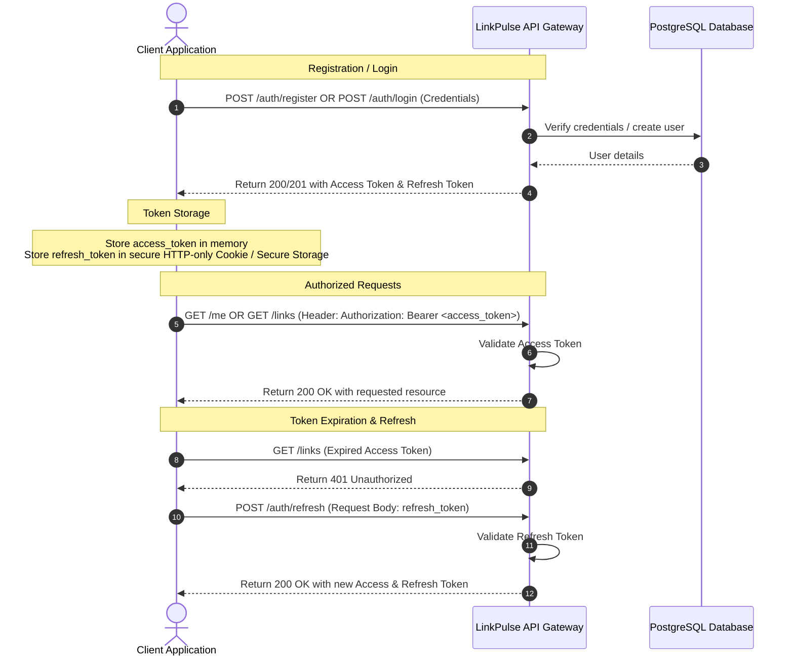

# LinkPulse API Endpoints Reference

This document lists all the API endpoints available in the LinkPulse application, categorized by authentication requirement, along with details on expected parameters, schemas, status codes, and example payloads.

---

## 💡 OpenAPI Specification
A formal OpenAPI 3.0 specification for this API is available in the repository at [openapi.yaml](file:///d:/LinkPulse/openapi.yaml). You can:
- Import `openapi.yaml` directly into **Postman** to generate an instant request collection.
- Render interactive API documentation using **Swagger UI** or **ReDoc**.
- Generate typed API client code for your frontend framework (React, Vue, Next.js, etc.).

---

## 🔒 Authentication Flow
LinkPulse uses JWT (JSON Web Tokens) for security. Below is the workflow for user registration, authentication, token storage, and refreshing:



---

## ❌ Standard Error Response Formats
Every endpoint on LinkPulse follows a consistent structure when returning error responses.

### 1. General Error Format (e.g. 401 Unauthorized, 404 Not Found, 409 Conflict, 500 Internal Error)
Returned when a request fails due to business rules, permissions, or system failures.
```json
{
  "error": "Detailed error message explanation"
}
```

### 2. Validation Error Format (e.g. 400 Bad Request)
Returned when the incoming request body has structural issues, missing parameters, or fails field-level constraints.
```json
{
  "error": "Invalid request",
  "details": "validation formatting or details of error",
  "errors": [
    {
      "field": "password",
      "message": "Key: 'RegisterRequest.Password' Error:Field validation for 'Password' failed on the 'min' tag"
    }
  ]
}
```

---

## 1. Unprotected / Authentication Endpoints

### Health Check
Check the API server health and status.

- **Method:** `GET`
- **URL:** `{{base_url}}/health`
- **Headers:** None
- **Path Parameters:** None
- **Query Parameters:** None
- **Request Body:** None
- **Status Codes:**
  - `200 OK`: Server is healthy.
  - `500 Internal Server Error`: Internal system error.
- **Response Schema:**
  - `status` (string): Always `"ok"` if healthy.
- **Example Response (200 OK):**
  ```json
  {
    "status": "ok"
  }
  ```

---

### User Registration
Register a new user account and receive JWT authentication tokens.

- **Method:** `POST`
- **URL:** `{{base_url}}/auth/register`
- **Headers:** `Content-Type: application/json`
- **Path Parameters:** None
- **Query Parameters:** None
- **Request Body (JSON):**
  ```json
  {
    "username": "johndoe",
    "email": "johndoe@example.com",
    "password": "password123"
  }
  ```
- **Request Schema:**
  - `username` (string, Required): Unique user name, length 2 to 50.
  - `email` (string, Required): Valid email format.
  - `password` (string, Required): Secret password string, minimum 8 characters.
- **Status Codes:**
  - `201 Created`: User successfully registered.
  - `400 Bad Request`: Validation failure (e.g. weak password, malformed JSON).
  - `409 Conflict`: Username or email already registered.
  - `500 Internal Server Error`: Register process failed on database/server.
- **Response Schema:**
  - `message` (string): Success message indicator.
  - `access_token` (string): JWT Access Token (short-lived).
  - `refresh_token` (string): JWT Refresh Token (long-lived).
  - `token` (string): JWT Access Token (included for compatibility/legacy clients).
- **Example Response (201 Created):**
  ```json
  {
    "message": "User registered successfully",
    "access_token": "eyJhbGciOiJIUzI1NiIsInR5cCI6IkpXVCJ9...",
    "refresh_token": "eyJhbGciOiJIUzI1NiIsInR5cCI6IkpXVCJ9...",
    "token": "eyJhbGciOiJIUzI1NiIsInR5cCI6IkpXVCJ9..."
  }
  ```

---

### User Login
Authenticate with email and password to receive JWT credentials.

- **Method:** `POST`
- **URL:** `{{base_url}}/auth/login`
- **Headers:** `Content-Type: application/json`
- **Path Parameters:** None
- **Query Parameters:** None
- **Request Body (JSON):**
  ```json
  {
    "email": "johndoe@example.com",
    "password": "password123"
  }
  ```
- **Request Schema:**
  - `email` (string, Required): Registered email address.
  - `password` (string, Required): Password matching account.
- **Status Codes:**
  - `200 OK`: Login successful.
  - `400 Bad Request`: Malformed payload or validation failed.
  - `401 Unauthorized`: Invalid credentials (incorrect password/email).
  - `500 Internal Server Error`: Server failure.
- **Response Schema:**
  - `access_token` (string): JWT Access Token.
  - `refresh_token` (string): JWT Refresh Token.
  - `token` (string): JWT Access Token (compatibility legacy token).
- **Example Response (200 OK):**
  ```json
  {
    "access_token": "eyJhbGciOiJIUzI1NiIsInR5cCI6IkpXVCJ9...",
    "refresh_token": "eyJhbGciOiJIUzI1NiIsInR5cCI6IkpXVCJ9...",
    "token": "eyJhbGciOiJIUzI1NiIsInR5cCI6IkpXVCJ9..."
  }
  ```

---

### Forgot Password
Initiate password reset process by generating a verification token.

- **Method:** `POST`
- **URL:** `{{base_url}}/auth/forgot-password`
- **Headers:** `Content-Type: application/json`
- **Path Parameters:** None
- **Query Parameters:** None
- **Request Body (JSON):**
  ```json
  {
    "email": "johndoe@example.com"
  }
  ```
- **Request Schema:**
  - `email` (string, Required): The email address associated with the account.
- **Status Codes:**
  - `200 OK`: Reset token generated and processed.
  - `400 Bad Request`: Validation/formatting error.
  - `404 Not Found`: Email not associated with any user.
  - `500 Internal Server Error`: Reset token generation failure.
- **Response Schema:**
  - `message` (string): Status message indicator.
  - `token` (string, Development mode only): UUID token string for Reset Password testing.
- **Example Response (200 OK):**
  ```json
  {
    "message": "Password reset link sent to your email",
    "token": "a1b2c3d4-e5f6..."
  }
  ```

---

### Reset Password
Reset the account password using a valid reset token.

- **Method:** `POST`
- **URL:** `{{base_url}}/auth/reset-password`
- **Headers:** `Content-Type: application/json`
- **Path Parameters:** None
- **Query Parameters:** None
- **Request Body (JSON):**
  ```json
  {
    "token": "a1b2c3d4-e5f6...",
    "new_password": "newpassword123"
  }
  ```
- **Request Schema:**
  - `token` (string, Required): The reset UUID token received from Forgot Password endpoint.
  - `new_password` (string, Required): The new password to set, minimum 8 characters.
- **Status Codes:**
  - `200 OK`: Password reset successfully.
  - `400 Bad Request`: Validation failure on password criteria or missing token.
  - `500 Internal Server Error`: Failed to update credentials in database.
- **Response Schema:**
  - `message` (string): Success indicator message.
- **Example Response (200 OK):**
  ```json
  {
    "message": "Password reset successfully"
  }
  ```

---

### Google OAuth Login
Initiate Google SSO authentication flow.

- **Method:** `GET`
- **URL:** `{{base_url}}/auth/google/login`
- **Headers:** None
- **Path Parameters:** None
- **Query Parameters:** None
- **Request Body:** None
- **Status Codes:**
  - `307 Temporary Redirect`: Redirects user's browser to the Google OAuth consent screen.
  - `500 Internal Server Error`: Google OAuth credentials are not configured on the server.
- **Response Schema:** None (browser redirects).

---

### Google OAuth Callback
Google SSO callback page that receives authorizations codes to exchange for LinkPulse JWT tokens.

- **Method:** `GET`
- **URL:** `{{base_url}}/auth/google/callback`
- **Headers:** None
- **Path Parameters:** None
- **Query Parameters:**
  - `code` (string, Required): Authorization code provided by Google redirect.
  - `state` (string, Required): Anti-forgery CSRF token matching the state cookie.
- **Request Body:** None
- **Status Codes:**
  - `200 OK`: Login successful, user validated or registered.
  - `400 Bad Request`: State parameter mismatch or missing authorization code.
  - `500 Internal Server Error`: Exchange validation failed, or database user creation failed.
- **Response Schema:**
  - `message` (string): Success message.
  - `access_token` (string): LinkPulse access JWT.
  - `refresh_token` (string): LinkPulse refresh JWT.
  - `token` (string): Legacy LinkPulse access JWT.
- **Example Response (200 OK):**
  ```json
  {
    "message": "Login successful",
    "access_token": "eyJhbGciOiJIUzI1NiIsInR5cCI6IkpXVCJ9...",
    "refresh_token": "eyJhbGciOiJIUzI1NiIsInR5cCI6IkpXVCJ9...",
    "token": "eyJhbGciOiJIUzI1NiIsInR5cCI6IkpXVCJ9..."
  }
  ```

---

### Google Token Exchange
Exchange a Google Access Token directly for LinkPulse JWT credentials (for mobile or single-page apps).

- **Method:** `POST`
- **URL:** `{{base_url}}/auth/google/token`
- **Headers:** `Content-Type: application/json`
- **Path Parameters:** None
- **Query Parameters:** None
- **Request Body (JSON):**
  ```json
  {
    "access_token": "<GOOGLE_ACCESS_TOKEN>"
  }
  ```
- **Request Schema:**
  - `access_token` (string, Required): Active Google access token.
- **Status Codes:**
  - `200 OK`: Token validated, LinkPulse credentials issued.
  - `400 Bad Request`: Missing `access_token` in body.
  - `401 Unauthorized`: Token verification failed with Google APIs.
  - `500 Internal Server Error`: Internal server authentication error.
- **Response Schema:**
  - `message` (string): Success feedback.
  - `access_token` (string): JWT Access Token.
  - `refresh_token` (string): JWT Refresh Token.
  - `token` (string): JWT Access Token.
- **Example Response (200 OK):**
  ```json
  {
    "message": "Login successful",
    "access_token": "eyJhbGciOiJIUzI1NiIsInR5cCI6IkpXVCJ9...",
    "refresh_token": "eyJhbGciOiJIUzI1NiIsInR5cCI6IkpXVCJ9...",
    "token": "eyJhbGciOiJIUzI1NiIsInR5cCI6IkpXVCJ9..."
  }
  ```

---

### Token Refresh
Generate new Access and Refresh tokens using a valid Refresh Token.

- **Method:** `POST`
- **URL:** `{{base_url}}/auth/refresh`
- **Headers:** `Content-Type: application/json`
- **Path Parameters:** None
- **Query Parameters:** None
- **Request Body (JSON):**
  ```json
  {
    "refresh_token": "<REFRESH_TOKEN>"
  }
  ```
- **Request Schema:**
  - `refresh_token` (string, Required): The valid JWT Refresh Token.
- **Status Codes:**
  - `200 OK`: Token refreshed successfully.
  - `400 Bad Request`: Missing `refresh_token` parameter.
  - `401 Unauthorized`: Invalid, tampered, or expired refresh token.
- **Response Schema:**
  - `access_token` (string): New JWT Access Token.
  - `refresh_token` (string): New JWT Refresh Token.
  - `token` (string): New JWT Access Token.
- **Example Response (200 OK):**
  ```json
  {
    "access_token": "eyJhbGciOiJIUzI1NiIsInR5cCI6IkpXVCJ9...",
    "refresh_token": "eyJhbGciOiJIUzI1NiIsInR5cCI6IkpXVCJ9...",
    "token": "eyJhbGciOiJIUzI1NiIsInR5cCI6IkpXVCJ9..."
  }
  ```

---

### Public Profile Page
Retrieve public links and info matching a user's vanity name.

- **Method:** `GET`
- **URL:** `{{base_url}}/u/:username`
- **Headers:** None
- **Path Parameters:**
  - `username` (string, Required): Username of the profile owner.
- **Query Parameters:** None
- **Request Body:** None
- **Status Codes:**
  - `200 OK`: Profile details and link arrays found.
  - `404 Not Found`: Username does not match any profile.
- **Response Schema:**
  - `username` (string): User identifier name.
  - `display_name` (string): Profile name displayed on header.
  - `bio` (string): Biography description.
  - `avatar_url` (string): Public path to avatar file.
  - `links` (array of `PublicLinkDTO` objects): List of active links.
    - `title` (string): Display text of link.
    - `slug` (string): Link route path slug.
- **Example Response (200 OK):**
  ```json
  {
    "username": "johndoe",
    "display_name": "John Doe",
    "bio": "Software Engineer & Creator",
    "avatar_url": "https://example.com/avatar.jpg",
    "links": [
      {
        "title": "My Favorite Website",
        "slug": "my-fav"
      }
    ]
  }
  ```

---

### Redirect Short Link (Click Tracking)
The short Link entrypoint that tracks visitor demographics and performs redirect to the target website.

- **Method:** `GET`
- **URL:** `{{base_url}}/u/:username/:slug`
- **Headers:** None
- **Path Parameters:**
  - `username` (string, Required): Owner user name.
  - `slug` (string, Required): Unique short link identifier path.
- **Query Parameters:** None
- **Request Body:** None
- **Status Codes:**
  - `302 Found`: Redirect action to the destination URL.
  - `404 Not Found`: Slug path does not match any active link for the user.
- **Response Schema:** Redirect Header.

---

## 2. Protected Endpoints (Requires JWT Auth)

> [!IMPORTANT]
> The following endpoints require validation of user sessions. You must provide a valid JWT Access Token in the authorization header:
> - **Header:** `Authorization`
> - **Value:** `Bearer <JWT_TOKEN>`

---

### Get Current User Info
Retrieve profile schema details of the authenticated requester.

- **Method:** `GET`
- **URL:** `{{base_url}}/me`
- **Headers:**
  - `Authorization: Bearer <JWT_TOKEN>` (Required)
- **Path Parameters:** None
- **Query Parameters:** None
- **Request Body:** None
- **Status Codes:**
  - `200 OK`: User record returned.
  - `401 Unauthorized`: Token invalid or authorization header missing.
  - `404 Not Found`: Account record not found in system.
  - `500 Internal Server Error`: Retrieval database failure.
- **Response Schema:**
  - `id` (string - UUID): Unique identifier.
  - `username` (string): Account username.
  - `email` (string): Account email address.
  - `plan` (string): Account tier subscription code.
  - `google_id` (string, Nullable): Connected Google SSO ID.
  - `created_at` (string - ISO 8601 Datetime): Creation timestamp.
  - `updated_at` (string - ISO 8601 Datetime): Last update timestamp.
- **Example Response (200 OK):**
  ```json
  {
    "id": "3b2d5a1a-4c4f-4d64-8968-3d162f48f4bf",
    "username": "johndoe",
    "email": "johndoe@example.com",
    "plan": "free",
    "google_id": null,
    "created_at": "2026-07-05T12:00:00Z",
    "updated_at": "2026-07-05T12:00:00Z"
  }
  ```

---

### Get User's Links
Retrieve a complete list of links created and owned by the user.

- **Method:** `GET`
- **URL:** `{{base_url}}/links`
- **Headers:**
  - `Authorization: Bearer <JWT_TOKEN>` (Required)
- **Path Parameters:** None
- **Query Parameters:** None
- **Request Body:** None
- **Status Codes:**
  - `200 OK`: Return array of owned Link objects.
  - `401 Unauthorized`: Token invalid or authorization header missing.
  - `500 Internal Server Error`: Retrieve action database failure.
- **Response Schema:**
  - `links` (array of `Link` objects):
    - `id` (string - UUID): Unique link ID.
    - `user_id` (string - UUID): Owner UUID.
    - `title` (string): Custom title for link.
    - `slug` (string): Unique sub-path identifier.
    - `destination_url` (string - URL): Destination target.
    - `is_active` (boolean): Flag setting status.
    - `click_count` (integer): Cumulative hits.
    - `created_at` (string - ISO 8601 Datetime): Creation time.
    - `updated_at` (string - ISO 8601 Datetime): Last modified time.
- **Example Response (200 OK):**
  ```json
  {
    "links": [
      {
        "id": "a1b2c3d4-e5f6-7a8b-9c0d-e1f2a3b4c5d6",
        "user_id": "3b2d5a1a-4c4f-4d64-8968-3d162f48f4bf",
        "title": "My Favorite Website",
        "slug": "my-fav",
        "destination_url": "https://example.com",
        "is_active": true,
        "click_count": 42,
        "created_at": "2026-07-05T12:00:00Z",
        "updated_at": "2026-07-05T12:00:00Z"
      }
    ]
  }
  ```

---

### Create a Link
Generate a new tracked short link vanity route slug.

- **Method:** `POST`
- **URL:** `{{base_url}}/links`
- **Headers:**
  - `Authorization: Bearer <JWT_TOKEN>` (Required)
  - `Content-Type: application/json`
- **Path Parameters:** None
- **Query Parameters:** None
- **Request Body (JSON):**
  ```json
  {
    "title": "My Favorite Website",
    "slug": "my-fav",
    "destination_url": "https://example.com"
  }
  ```
- **Request Schema:**
  - `title` (string, Required): Display name of URL link.
  - `slug` (string, Required): Unique routing path matching client.
  - `destination_url` (string - URL, Required): Target destination URL web path.
- **Status Codes:**
  - `201 Created`: Link entry logged successfully.
  - `400 Bad Request`: Parsing issues or missing/malformed validation fields.
  - `401 Unauthorized`: Authentication token failure.
  - `500 Internal Server Error`: Write operation database failure.
- **Response Schema:**
  - `message` (string): Success confirmation message.
- **Example Response (201 Created):**
  ```json
  {
    "message": "Link created successfully"
  }
  ```

---

### Update a Link
Modify configuration parameters (Title, Slug, Destination URL) of a specific short link.

- **Method:** `PUT`
- **URL:** `{{base_url}}/links/:id`
- **Headers:**
  - `Authorization: Bearer <JWT_TOKEN>` (Required)
  - `Content-Type: application/json`
- **Path Parameters:**
  - `id` (string - UUID, Required): The unique UUID of the target link.
- **Query Parameters:** None
- **Request Body (JSON):**
  ```json
  {
    "title": "Updated Website Title",
    "slug": "updated-slug",
    "destination_url": "https://new-destination-example.com"
  }
  ```
- **Request Schema:**
  - `title` (string, Required): The modified title.
  - `slug` (string, Required): The modified slug path.
  - `destination_url` (string - URL, Required): The updated redirection endpoint URL.
- **Status Codes:**
  - `200 OK`: Link model properties updated successfully.
  - `400 Bad Request`: Invalid link ID formatting or validation errors.
  - `401 Unauthorized`: Authentication token failure.
  - `403 Forbidden`: Requester does not own this link.
  - `404 Not Found`: Link matching ID not found.
  - `500 Internal Server Error`: Database update execution failed.
- **Response Schema:**
  - `message` (string): Success verification message.
  - `link` (`Link` object): Full updated link record structure.
- **Example Response (200 OK):**
  ```json
  {
    "message": "link updated successfully",
    "link": {
      "id": "a1b2c3d4-e5f6-7a8b-9c0d-e1f2a3b4c5d6",
      "user_id": "3b2d5a1a-4c4f-4d64-8968-3d162f48f4bf",
      "title": "Updated Website Title",
      "slug": "updated-slug",
      "destination_url": "https://new-destination-example.com",
      "is_active": true,
      "click_count": 42,
      "created_at": "2026-07-05T12:00:00Z",
      "updated_at": "2026-07-05T12:05:00Z"
    }
  }
  ```

---

### Update Link Status (Enable/Disable)
Enable or disable redirect resolving behavior for a link.

- **Method:** `PATCH`
- **URL:** `{{base_url}}/links/:id/status`
- **Headers:**
  - `Authorization: Bearer <JWT_TOKEN>` (Required)
  - `Content-Type: application/json`
- **Path Parameters:**
  - `id` (string - UUID, Required): Unique ID of the link.
- **Query Parameters:** None
- **Request Body (JSON):**
  ```json
  {
    "is_active": false
  }
  ```
- **Request Schema:**
  - `is_active` (boolean, Required): Toggle to enable (`true`) or disable (`false`) redirect resolution.
- **Status Codes:**
  - `200 OK`: Link resolution status successfully modified.
  - `400 Bad Request`: Link ID parameter format error or request validation failure.
  - `401 Unauthorized`: Verification token missing or invalid.
  - `403 Forbidden`: User lacks permission to change this link.
  - `404 Not Found`: Link not found.
  - `500 Internal Server Error`: Modification transaction error.
- **Response Schema:**
  - `message` (string): Confirmational state message.
  - `is_active` (boolean): Updated status code matching request.
- **Example Response (200 OK):**
  ```json
  {
    "message": "link disabled successfully",
    "is_active": false
  }
  ```

---

### Delete a Link
Permanently delete an active link configuration.

- **Method:** `DELETE`
- **URL:** `{{base_url}}/links/:id`
- **Headers:**
  - `Authorization: Bearer <JWT_TOKEN>` (Required)
- **Path Parameters:**
  - `id` (string - UUID, Required): The unique UUID of the target link.
- **Query Parameters:** None
- **Request Body:** None
- **Status Codes:**
  - `200 OK`: Link successfully removed.
  - `400 Bad Request`: Invalid ID format parameter.
  - `401 Unauthorized`: Verification token missing or invalid.
  - `403 Forbidden`: Current user is unauthorized to delete this link.
  - `404 Not Found`: Match target link not found.
  - `500 Internal Server Error`: Deletion execution failed on database.
- **Response Schema:**
  - `message` (string): Success indicator message.
- **Example Response (200 OK):**
  ```json
  {
    "message": "link deleted successfully"
  }
  ```

---

### Update Profile
Update profile customization values of the current user.

- **Method:** `PUT`
- **URL:** `{{base_url}}/profile`
- **Headers:**
  - `Authorization: Bearer <JWT_TOKEN>` (Required)
  - `Content-Type: application/json`
- **Path Parameters:** None
- **Query Parameters:** None
- **Request Body (JSON):** (At least one of the fields is required)
  ```json
  {
    "display_name": "John Doe",
    "bio": "Software Engineer & Creator",
    "avatar_url": "https://example.com/avatar.jpg"
  }
  ```
- **Request Schema:**
  - `display_name` (string, Optional): Custom user name displayed on page.
  - `bio` (string, Optional): Biography profile text summary.
  - `avatar_url` (string - URL, Optional): HTTP link location of user profile image.
- **Status Codes:**
  - `200 OK`: Profile details updated successfully.
  - `400 Bad Request`: Empty request parameters or invalid formats.
  - `401 Unauthorized`: JWT validation failure.
  - `500 Internal Server Error`: Write execution database transaction failed.
- **Response Schema:**
  - `message` (string): Success notification.
  - `profile` (`Profile` object): Detailed profile properties struct.
    - `user_id` (string - UUID): Owner UUID.
    - `display_name` (string): Profile Display text.
    - `bio` (string): Biography details.
    - `avatar_url` (string): URL address of image.
    - `created_at` (string - ISO 8601 Datetime): Entry log creation.
    - `updated_at` (string - ISO 8601 Datetime): Entry log modification.
- **Example Response (200 OK):**
  ```json
  {
    "message": "profile updated successfully",
    "profile": {
      "user_id": "3b2d5a1a-4c4f-4d64-8968-3d162f48f4bf",
      "display_name": "John Doe",
      "bio": "Software Engineer & Creator",
      "avatar_url": "https://example.com/avatar.jpg",
      "created_at": "2026-07-05T12:00:00Z",
      "updated_at": "2026-07-05T12:10:00Z"
    }
  }
  ```

---

### Get Analytics Overview
Retrieve summary click counters metrics across all links owned by the user.

- **Method:** `GET`
- **URL:** `{{base_url}}/analytics/overview`
- **Headers:**
  - `Authorization: Bearer <JWT_TOKEN>` (Required)
- **Path Parameters:** None
- **Query Parameters:** None
- **Request Body:** None
- **Status Codes:**
  - `200 OK`: Overview counts successfully scanned and calculated.
  - `401 Unauthorized`: Auth token missing or invalid.
  - `500 Internal Server Error`: Database query resolution failed.
- **Response Schema:**
  - `total_links` (integer): Total number of links created by this user.
  - `total_clicks` (integer): Sum of all redirect events registered across all links.
  - `clicks_today` (integer): Number of clicks recorded since current day midnight boundary.
- **Example Response (200 OK):**
  ```json
  {
    "total_links": 5,
    "total_clicks": 348,
    "clicks_today": 12
  }
  ```

---

### Get Link-by-Link Analytics
Retrieve click metric breakdown matching each link created by the user.

- **Method:** `GET`
- **URL:** `{{base_url}}/analytics/links`
- **Headers:**
  - `Authorization: Bearer <JWT_TOKEN>` (Required)
- **Path Parameters:** None
- **Query Parameters:** None
- **Request Body:** None
- **Status Codes:**
  - `200 OK`: Per-link metrics calculated.
  - `401 Unauthorized`: Auth credentials verification error.
  - `500 Internal Server Error`: Scanning rows from table failed.
- **Response Schema:** Array of `LinkAnalyticsDTO` objects:
  - `title` (string): Title of URL shortener.
  - `slug` (string): Slug string vanity identifier.
  - `clicks` (integer): Total number of redirect executions recorded.
- **Example Response (200 OK):**
  ```json
  [
    {
      "title": "My Favorite Website",
      "slug": "my-fav",
      "clicks": 45
    },
    {
      "title": "Portfolio Page",
      "slug": "portfolio",
      "clicks": 18
    }
  ]
  ```

---

### Get Daily Analytics
Retrieve daily aggregated redirect events statistics.

- **Method:** `GET`
- **URL:** `{{base_url}}/analytics/daily`
- **Headers:**
  - `Authorization: Bearer <JWT_TOKEN>` (Required)
- **Path Parameters:** None
- **Query Parameters:**
  - `days` (integer, Optional): Number of trailing days to retrieve daily click stats for. **Default: `7`**.
- **Request Body:** None
- **Status Codes:**
  - `200 OK`: Aggregations computed successfully.
  - `400 Bad Request`: Query parameter parse failure.
  - `401 Unauthorized`: Verification credential failure.
  - `500 Internal Server Error`: Aggregations calculation database error.
- **Response Schema:**
  - `data` (array of `DailyAnalyticsDTO` objects):
    - `date` (string - `YYYY-MM-DD` Format): Aggregation calendar date.
    - `clicks` (integer): Aggregation counts during the corresponding day interval.
- **Example Response (200 OK) (`GET /analytics/daily?days=7`):**
  ```json
  {
    "data": [
      {
        "date": "2026-06-28",
        "clicks": 15
      },
      {
        "date": "2026-06-27",
        "clicks": 9
      }
    ]
  }
  ```

---

### Get Recent Activity
Fetch recent individual redirection log hits recorded.

- **Method:** `GET`
- **URL:** `{{base_url}}/analytics/recent`
- **Headers:**
  - `Authorization: Bearer <JWT_TOKEN>` (Required)
- **Path Parameters:** None
- **Query Parameters:**
  - `limit` (integer, Optional): Limits list records length. Minimum: `1`, Maximum: `100`. **Default: `20`**.
- **Request Body:** None
- **Status Codes:**
  - `200 OK`: Recent logs fetched successfully.
  - `400 Bad Request`: Query parameter validation error.
  - `401 Unauthorized`: Token invalid.
  - `500 Internal Server Error`: Query logs scan transaction error.
- **Response Schema:**
  - `data` (array of `RecentActivityDTO` objects):
    - `link_title` (string): Name of link triggered.
    - `slug` (string): Short slug triggered.
    - `clicked_at` (string - ISO 8601 Datetime): Exact hit timestamp.
    - `ip_address` (string): Visitor host IP.
    - `referrer` (string): Target referrer URL string (`"Direct"` if blank).
- **Example Response (200 OK) (`GET /analytics/recent?limit=20`):**
  ```json
  {
    "data": [
      {
        "link_title": "My Favorite Website",
        "slug": "my-fav",
        "clicked_at": "2026-06-28T12:00:00Z",
        "ip_address": "127.0.0.1",
        "referrer": "Direct"
      }
    ]
  }
  ```

---

### Get Referrer Analytics
Retrieve total redirection hits grouped by visitor referrer source.

- **Method:** `GET`
- **URL:** `{{base_url}}/analytics/referrers`
- **Headers:**
  - `Authorization: Bearer <JWT_TOKEN>` (Required)
- **Path Parameters:** None
- **Query Parameters:** None
- **Request Body:** None
- **Status Codes:**
  - `200 OK`: Grouped list fetched and sorted successfully.
  - `401 Unauthorized`: Access token error.
  - `500 Internal Server Error`: Grouping queries database scan failure.
- **Response Schema:** Array of `ReferrerAnalyticsDTO` objects:
  - `referrer` (string): Normalized origin domain source (e.g. `"Google"`, `"Twitter"`, or `"Direct"`).
  - `clicks` (integer): Cumulative hits matching the referrer.
- **Example Response (200 OK):**
  ```json
  [
    {
      "referrer": "Google",
      "clicks": 45
    },
    {
      "referrer": "Direct",
      "clicks": 12
    }
  ]
  ```
